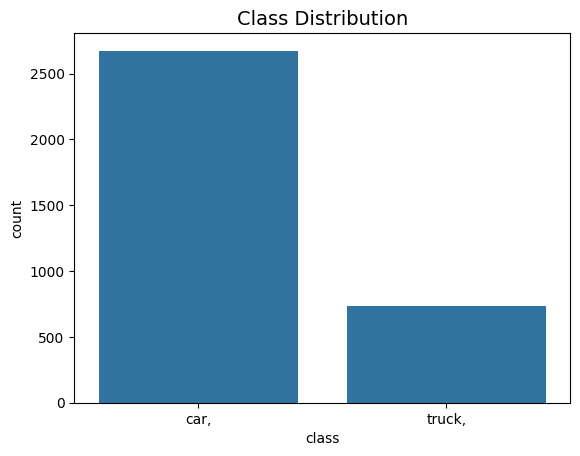
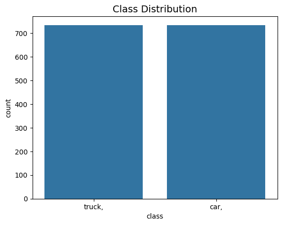
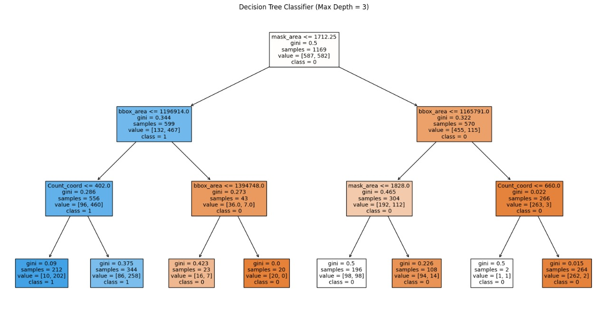
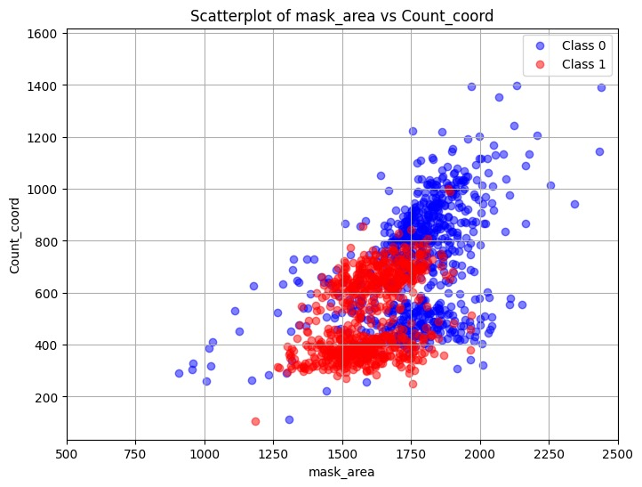
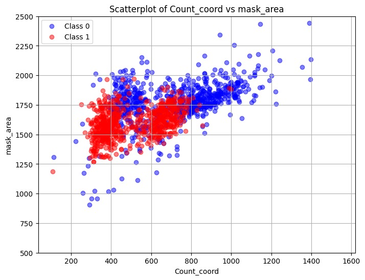
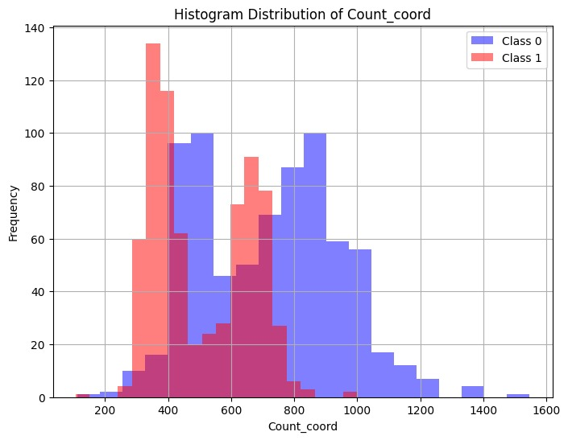
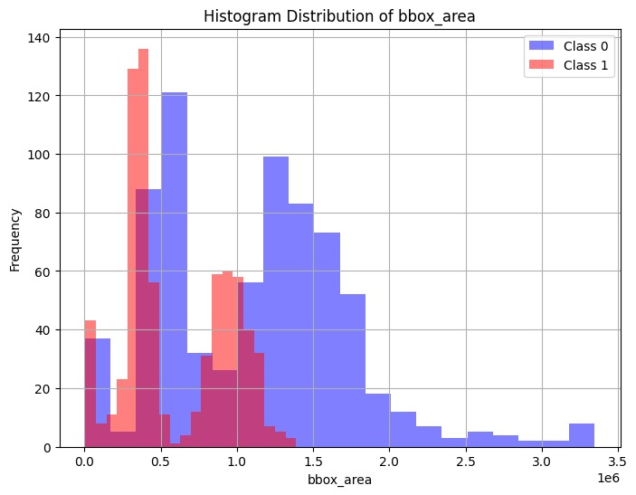
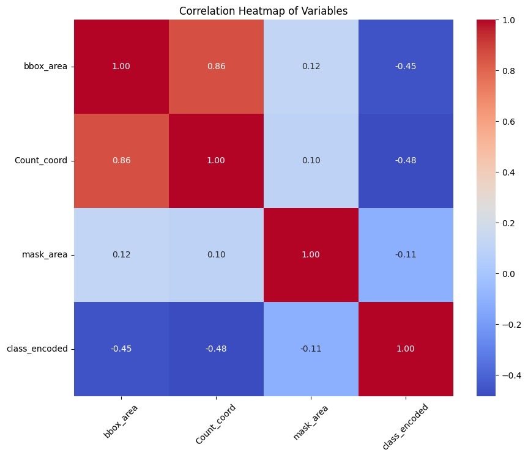

# Traffic Object Classification System
## Team Members
- Tejesh
- Uday
## Overview
This Python-based project is designed to classify traffic objects using advanced data analytics and machine learning techniques. It systematically processes, visualizes, and models traffic data to accurately categorize various vehicle types. The primary objective is to enhance the capabilities of traffic management systems through improved data-driven insights.

## Prerequisites
To successfully run this project, ensure you have the following software installed:
- Python 3.x
- Pandas
- NumPy
- Matplotlib
- Seaborn
- scikit-learn
## Directory Structure
- `traffic_classification.py`: The main script for data processing and model evaluation.

## Installation and Usage
1. Clone the repository to your local machine.
2. Install the required dependencies using:

>pip install -r requirements.txt

3. Execute the script with the following command:
>python traffic_classification.py

This will process the data and output the results of the classification models.

## Data Processing
The initial phase involves loading and cleansing the dataset, which includes removing unnecessary prefixes and whitespace from object labels. Subsequent steps involve segregating the data by vehicle types, such as cars and trucks, and balancing the dataset to ensure uniformity across classes.

## Visualizations
### Class Distribution Before and After Balancing
#### Class Distribution - Original Data

This bar chart shows the class distribution in the original dataset, highlighting any imbalance between the classes.

#### Class Distribution - Balanced Data

After applying balancing techniques, this bar chart reflects the new even distribution, which is essential for unbiased model training.
### Decision Tree Classifier

The decision tree visualization represents the model structure used to classify traffic objects. The tree branches out based on feature thresholds, indicating the decision paths taken to reach a classification decision.

### Scatter Plots
#### Scatterplot of mask_area vs Count_coord

This scatterplot visualizes the relationship between the `mask_area` and the `Count_coord` features, colored by class. It highlights the feature space where the classifications are divided.

#### Scatterplot of Count_coord vs mask_area

This plot is similar to the previous one but swaps the axes, providing a different perspective on the same data points and feature interaction.

### Histograms
#### Histogram Distribution of Count_coord

The histogram shows the frequency distribution of the `Count_coord` feature across both classes. It is useful for understanding the variance and skewness within the feature.

#### Histogram Distribution of bbox_area

This histogram illustrates the distribution of the `bbox_area` feature for each class, offering insights into the data spread and potential outliers.

### Correlation Heatmap

The heatmap indicates the correlation between different features, as well as each feature's correlation with the target class. This is crucial for feature selection and understanding which features have more predictive power.

## Model Evaluation
The system evaluates the performance of the Decision Tree and Random Forest models, providing detailed accuracy metrics and classification reports that include precision, recall, and F1-scores for each class.
## Model Evaluation Results

### Decision Tree Classifier:
- **Training Accuracy**: 1.0
- **Testing Accuracy**: 0.8253424657534246

#### Classification Report for Testing Data (Decision Tree):

          precision    recall  f1-score   support

       0       0.80      0.87      0.83       147
       1       0.86      0.78      0.82       145

accuracy                           0.83       292

### Random Forest Classifier:
- **Training Accuracy**: 1.0
- **Testing Accuracy**: 0.8767123287671232

#### Classification Report for Testing Data (Random Forest):

          precision    recall  f1-score   support

       0       0.86      0.90      0.88       147
       1       0.89      0.86      0.87       145

accuracy                           0.88       292

## Usage
1. Clone the repository to your local machine.
2. Install the required dependencies using:

## Acknowledgements
This project was developed as a part of an advanced analytics initiative aimed at leveraging machine learning to improve traffic management systems. We express our gratitude towards Prof Tyler and Mirwais.
